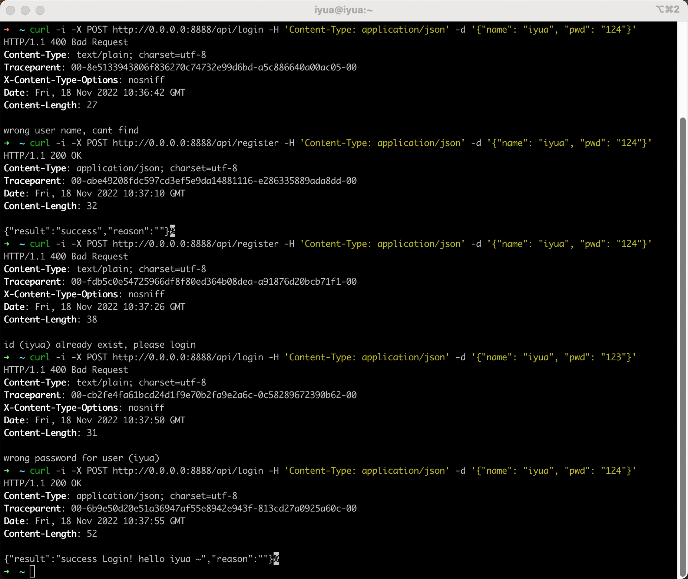

### 步骤
```text 
# 初步工作
mkdir go-zero-demo && cd go-zero-demo
go mod init loginRegister

# 拉取镜像 运行容器
docker pull mongo
docker run -itd --name mongo -p 27017:27017 mongo --auth

# 容器内安装vim 编辑/etc/mongod.conf.orig
# 删掉 bind 127.0.0.1 或改为 0.0.0.0 
docker exec -it mongo /bin/bash
apt update
apt install vim
vim /etc/mongod.conf.orig 

# mongo内建立一个用于测试的db与collection
docker exec -it mongo mongosh admin
db.auth('admin','123456')
use loginAndRegister # 创建或切换db
db.createCollection("user")

# 生成mongo CRUD
mkdir model && cd model
goctl model mongo --type User --dir .

# 生成api
mkdir api && cd api
    编写 handler.api
goctl api go -api handler.api -dir .
vim ./internal/svc/servicecontext.go 
    context内添加 mongo
实现 ./internal/logic/* 的逻辑
    默认的FindOne根据id查询，可以修改filter改为根据name查询


# 运行服务
cd api
go run login.go -f etc/login.yaml
```
[mongoDB](https://www.runoob.com/mongodb/mongodb-tutorial.html)

[go-zero](https://legacy.go-zero.dev/cn/micro-service.html)

### 测试
